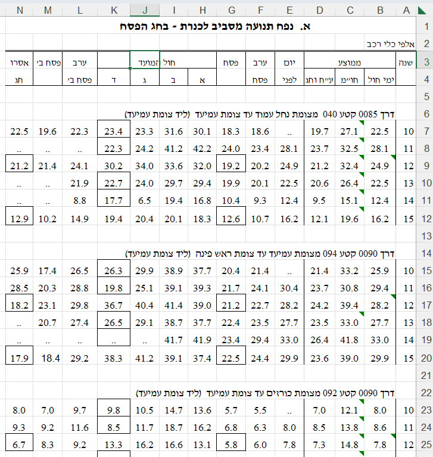

# הכנת נתונים {#sec-data-munging-tidyverse}

הכנת נתונים, או כמו שהיא מכונה באנגלית, Data Munging, היא סדר הפעולות שיש לעשות לנתונים על מנת שאפשר יהיה להשתמש בהם בכלל שלבי המחקר, כגון הצגת נתונים (ויז'ואליזציה), מידול, ובפעולות נוספות במהלך המחקר. בספר זה, אנחנו עושים שימוש רב בחבילת `tidyverse` על מנת להכין את הנתונים.

ראשית, נעמוד על הפילוסופיה מאחורי `tidyverse`.

## הפילוסופיה מאחורי `tidyverse`

החבילה ב-R שנקראת `tidyverse` היא למעשה "חבילה של חבילות".\
היא מכילה מקבץ חבילות לעבודה עם נתונים כמו `dplyr`, וכמו `tidyr` שהן חבילות מאוד שימושיות במניפולציה על נתונים, וסידור נתונים, אבל היא מכילה גם חבילות שממוקדות סביב עולמות תוכן אחרים, כמו `stringr` לעבודה עם מחזורות, `lubridate` לעבודה עם תאריכים, ו-`forcats` לעבודה עם פקטורים. כפי שחדי העין ישימו לב, לרוב שם של חבילה ירמוז לגבי מהות החבילה (לעיתים עם האות r איפשהו, ולעיתים עם קורטוב של הומור). הפירוט המלא של תוכן החבילה `tidyverse`והחבילות שמוכלות בה זמין [בקישור](https://www.tidyverse.org/).

על מנת להתקין את החבילה נשתמש בפקודה `install.packages("tidyverse")`, ועל מנת לטעון אותה לאחר ההתקנה, נשתמש בפקודה `library(tidyverse)`. שימו לב שבהתקנה צריך להשתמש במרכאות אבל בקריאה לאחר מכן אין צורך במרכאות. את ההתקנה צריך לעשות רק פעם אחת (והיא לוקחת המון זמן), ואת הקריאה לספריה צריך לעשות כל פעם שמפעילים מחדש את R.

כשלב יסודי, מה שחשוב להבין בעבודה עם נתונים זה שהשאיפה היא שתמיד נשאף להגיע ולעבוד במבנה מסודר שבו:

1.  כל עמודה היא משתנה.
2.  כל שורה היא תצפית.
3.  כל תא הוא ערך של משתנה עבור תצפית מסוימות.

אם הדאטה המקורי שלנו לא במבנה הזה - אז כהכנה נרצה להביא אותו למבנה כזה, ואם הוא כבר במבנה המסודר הזה, אז כל פעולה שנעשה, עדיין תשמור את הדאטה במבנה מסודר. המבנה הזה מכונה באנגלית tidy (ומכאן השם tidyverse). אנחנו פשוט נכנה אותו פה מבנה "מסודר".

ניתן שתי דוגמאות לדאטה, אחד מסודר ואחר לא מסודר. נתחיל בדוגמה לדאטה לא מסודר.

### דוגמה לדאטה לא מסודר

הלשכה המרכזית לסטטיסטיקה מנגישה הרבה נתונים לציבור באמצעות האתר שלה https://www.cbs.gov.il\
מרבית הנתונים שמונגשים לציבור דרך האתר בקבצי אקסל הינם בפורמט לא מסודר. לדוגמה, קובץ שהורדתי מהכתובת [הזו](https://www.cbs.gov.il/he/publications/Pages/2016/%D7%A1%D7%A4%D7%99%D7%A8%D7%95%D7%AA-%D7%AA%D7%A0%D7%95%D7%A2%D7%94-%D7%91%D7%93%D7%A8%D7%9B%D7%99%D7%9D-%D7%9C%D7%90-%D7%A2%D7%99%D7%A8%D7%95%D7%A0%D7%99%D7%95%D7%AA-2015-2010.aspx) והוא עוסק בנפח תנועה מסביב לכנרת בחג הפסח וסוכות.

זה קובץ אקסל, והוא נראה כך:

{fig-alt="דאטה לא-מסודר מאתר הלשכה המרכזית לסטטיסטיקה" fig-align="center"}

איפה הבעיות עם הדאטה? נראה מה הסעיפים שאינם מתקיימים:

1.  כל עמודה היא משתנה - מתקיים באופן חלקי. משום שיש עמודות מסוימות כמו עמודות H-K שהן ממוזגות מה שהופך אותם ל"לא בדיוק משתנה יחיד". מדובר בקבוצת משתנים ותכונה שמתארת אותם. בפרט, היינו מצפים לראות שורת כותרת אחת שמתארת את שמות המשתנים (מה שמכונה באנגלית headers), אבל בפועל יש פה הרבה שורות כותרות.
2.  כל שורה היא תצפית - לא מתקיים בכלל. יש שורות ריקות (כמו שורה 5), ויש שורות שאינן תצפית אלא מתארות תכונות של מקבץ תצפיות (כגון שורה 6 ושורה 14).
3.  כל תא הוא ערך של משתנה עבור תצפית מסוימת - לא מתקיים. ראו סעיף קודם - מדובר בתאים שמכילים ערכים שמתארים מקבץ תצפיות.

כמו כן, יש עוד כל מיני חריגות לא ברורות בקובץ כגון תאים שמודגשים במסגרת גבול שחורה (מבלי שברור מה המסגרת אומרת), יש תאים שמכילים שתי נקודות (לא ברור מה זה, האם ערך חסר?), שמות המשתנים לעיתים מפוצלים על פני שתי שורות (כמו לדוגמה "ערב פסח" בעמודה F), ועוד בעיות.

בסיכומו של עניין - אילו היינו רוצים לקלוט קובץ כזה לתוך R על מנת לחלץ את המספרים שבו, היינו צריכים להתאמץ רבות על מנת להפוך את הקובץ למסודר. באופן כללי, ניתן לומר שקבצי אקסל הם מתכון לאסון כי הם מעודדים את המשתמשים לבנות קבצים לא-מסודרים על ידי ביצוע פעולות כמו מיזוג תאים, צביעה של תאים (שזה אינדיקציה לקידוד מידע כלשהו, אבל קידוד שקשה להבין אותו ב"שפת הנתונים"), ועוד שאר בעיות שאין זה המקום לתאר.

### דוגמה לדאטה מסודר

הנה דוגמה לדאטה מסודר מתוך חבילת `palmerpenguins`. חבילה זו מכילה נתונים של שלושה זנים של פינגוינים, ואנחנו עוד נשתמש בה בהמשך הספר. לכרגע רק נראה איך נראות עשרת השורות הראשונות בטבלת הנתונים (הסבר על הקוד והתוצר שרואים מצורף מטה):

```{r showing palmer penguins}
palmerpenguins::penguins
```

אנחנו רואים שהאובייקט הוא מסוג tibble (טבלה שהיא גרסה מודרנית יותר של ה-`data.frame` הבסיסי ב-R). לטבלה הזו יש 344 תצפיות (פינגוינים), ויש לה 8 עמודות (משתנים) שכוללים את הזן של הפינגוין, מאיזה אי הוא, אורך ועומד המקור, אורך הכנף, מסה, מין, והשנה שבה נצפתה הדגימה. הדאטה הזה מסודר ועומד בכללים שהגדרנו.

לגבי הקוד עצמו שבו השתמשנו: השימוש בנקודותיים `::` אומר ל-R לקחת את האובייקט `penguins` שנמצא בתוך חבילת `palmerpenguins` (אפשר גם היה לפצל את הקוד וקודם להשתמש ב-`library(palmerpenguins)` ואז להריץ את `head(penguins)`.

אם תרצו להריץ את הקוד הזה אצלכם במחשב, יכול להיות שתצטרכו קודם להתקין את החבילה על ידי שימוש בפקודה `install.packages("palmerpenguins")`.

כעת לאחר שלמדנו קצת על מה הוא דאטה מסודר, נראה איך אפשר לקרוא נתונים ו"להציץ" בנתונים, כדי לקבל מושג מה יש בנתונים ואיך לגשת אליהם.

## הצצה ראשונית על הנתונים

בדרך כלל לפני הצצה ראשונית על הנתונים, אנחנו נידרש לקרוא אותם. קריאת הנתונים יכולה להתבצע ממגוון פורמטים. לדוגמה:

-   קריאה מפורמט של CSV (Comma Separated Values, קרי קובץ טקסט המפריד ערכים באמצעות פסיקים), באמצעות פונקציות כגון `read.csv`, `readr::read_csv`.

-   קריאה מפורמט של אקסל באמצעות פונקציה כגון: `readxl::read_excel`.

-   קריאה מפורמט של תוכנות סטטיסטיות אחרות כגון SPSS או SAS באמצעות פקודות מחבילת `haven`.

-   פורמטים וכלים נוספים.

נתמקד בקבצי CSV, הפקודה המועדפת עלי היא `readr::read_csv` (בהשוואה ל-`read.csv` שנמצאת ב-Base R). הפקודה `read_csv` מעט מהירה ונוחה יותר מבחינת השליטה שהיא מאפשרת בקריאת הנתונים.

<div class=question>

קראו את התיעוד של `read.csv` ושל `read_csv`. איזה הבדלים אתם מזהים בין הפקודות?

לצורך קריאת התיעוד ניתן לכתוב ב-Console `?read.csv`, `?readr::read_csv`.

</div>

נקרא כעת את טבלת הPenguins שראינו בחלק הקודם. שימו לב שאנחנו משתמשים במיקום קובץ באינטרנט, אבל ניתן גם לקרוא קבצים שנמצאים מקומית על המחשב.

```{r reading penguins, cache=TRUE}
library(readr)
penguins <- read_csv("https://raw.githubusercontent.com/allisonhorst/palmerpenguins/main/inst/extdata/penguins.csv")
```

## פעולות שמשנות ערכים (טרנספורמציות)

## פעולות על שורות (סינון)

## פעולות לפי קיבוצים (סיכום)

## חיבור בין טבלאות
